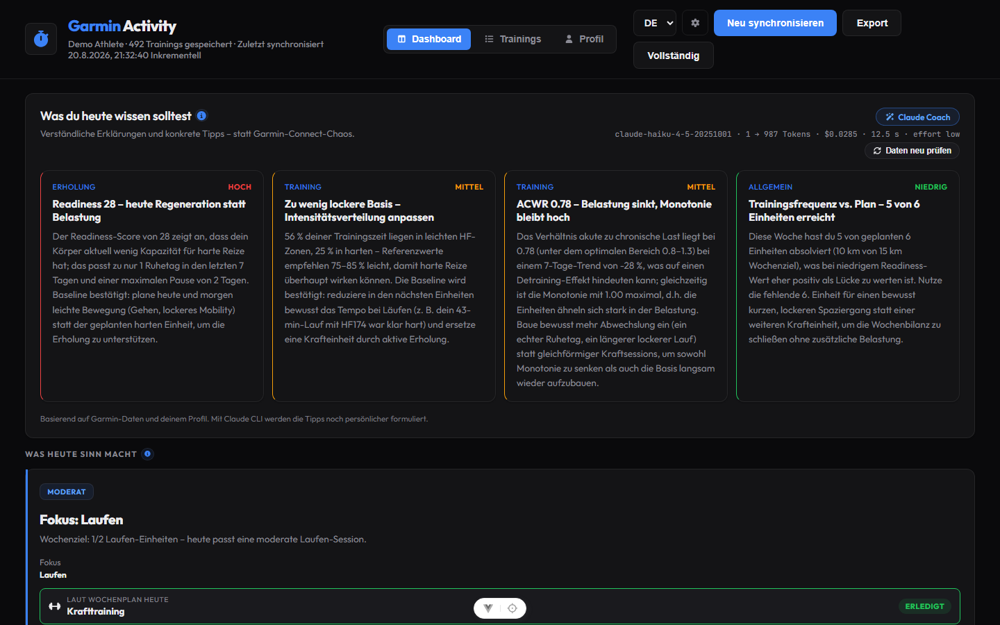
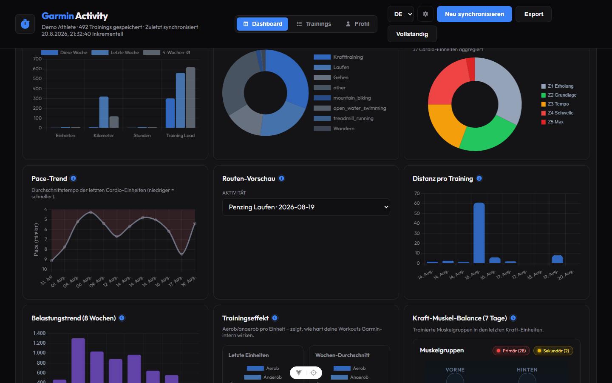
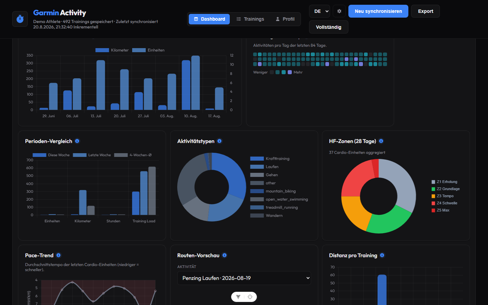
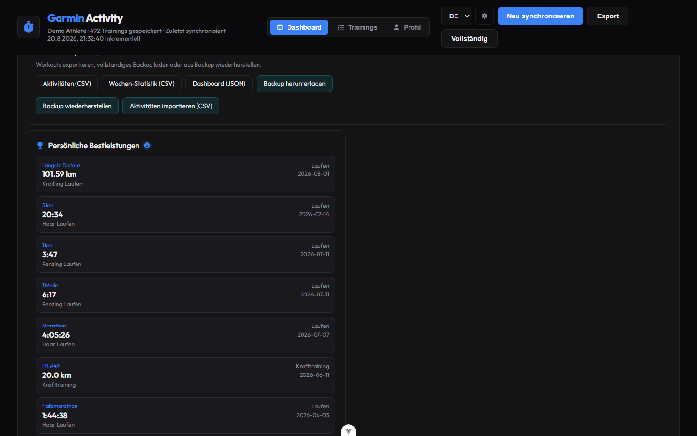
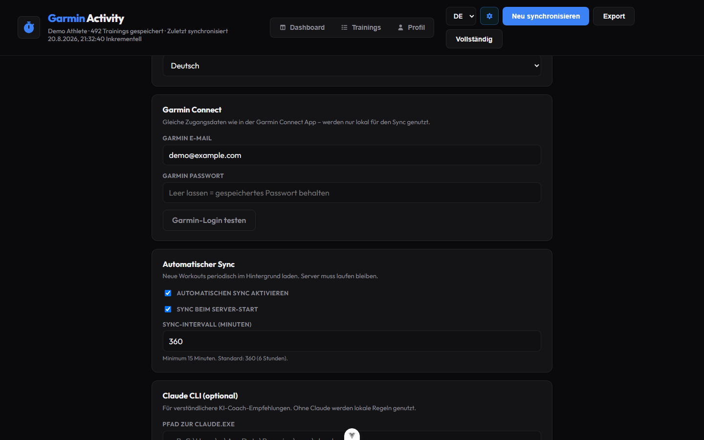
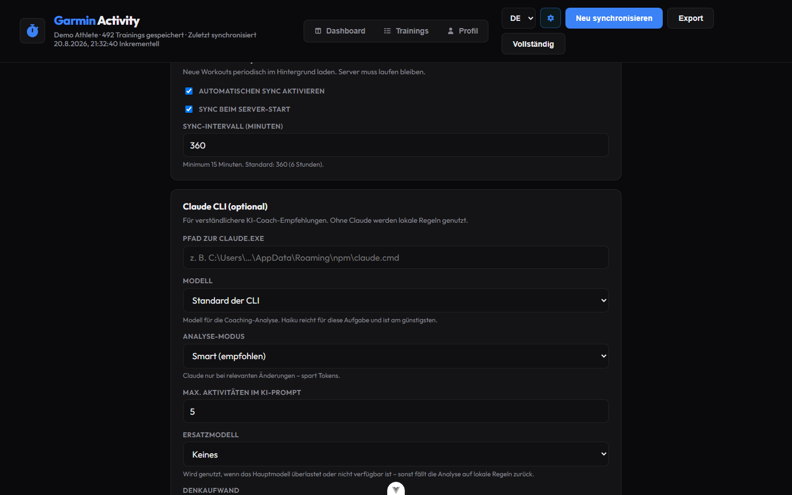

# Garmin Activity Dashboard

A self-hosted dashboard for **Garmin Connect** training data — with analytics, planning, recovery metrics, optional **Claude CLI** integration, **automatic sync**, and **data export/backup**.

All data stays on your machine. No cloud hosting and no Anthropic API key required.

> **Not affiliated with Garmin.** This is an independent hobby project and is neither
> built, endorsed, nor supported by Garmin Ltd. "Garmin" and "Garmin Connect" are
> trademarks of Garmin Ltd. and are used here only to describe the data source. The
> integration uses an **unofficial, undocumented API** that can break or be blocked at
> any time, and using it may conflict with Garmin's terms of service — you are
> responsible for deciding whether to run this against your own account.



---

## Table of contents

- [Features](#features)
- [Screenshots](#screenshots)
- [Tech stack](#tech-stack)
- [Requirements](#requirements)
- [Installation & setup](#installation--setup)
- [First-run setup (in-app)](#first-run-setup-in-app)
- [Running the app](#running-the-app)
- [Usage](#usage)
- [Training profile](#training-profile)
- [Data sync](#data-sync)
- [Automatic sync](#automatic-sync)
- [Data export & backup](#data-export--backup)
- [AI recommendations](#ai-recommendations)
- [Languages](#languages)
- [Environment variables](#environment-variables)
- [Local data storage](#local-data-storage)
- [Troubleshooting](#troubleshooting)
- [Security](#security)
- [License & acknowledgements](#license--acknowledgements)

---

## Features

### Navigation (3 areas + settings)

| Tab                      | Content                                                             |
| ------------------------ | ------------------------------------------------------------------- |
| **Dashboard**            | Overview, analytics, planning, recovery, charts                     |
| **Trainings**            | Full activity list with search, filters, and inline detail          |
| **Profile**              | Athlete type, weekly targets, planned races, AI context             |
| **Settings (gear icon)** | Garmin credentials, Claude CLI, auto-sync, sync limits, server port |

### Automation & sync progress

- **Automatic sync** – optional background sync on an interval (server must stay running)
- **Sync on startup** – fetch new workouts when the API starts
- **Sync progress bar** – live phase/progress during sync with retry on error
- **Garmin login test** – verify credentials in Settings before saving

### First-run setup

- **Setup wizard** – shown automatically on first launch when no config exists
- **Local config file** – settings are saved to `data/app-config.json` on your machine
- **No manual `.env` required** – configure everything in the browser (advanced users can still use `.env`)
- **Auto-migration** – existing `.env` values are imported into `app-config.json` on first server start

### Dashboard – status & metrics

- **Wellness cards** – training status, readiness, VO₂max, sleep score, ACWR
- **KPI cards** – sessions this week, weekly km, training streak, total activities, weekly load
- **Language selector** – German / English (persisted in the browser)

### Dashboard – planning & recovery

- **Today's plan** – daily recommendation from readiness, sleep, ACWR, training status, and weekly goals
- **Recovery & sleep** – sleep score, sleep stages (deep/REM/light), body battery, stress, resting HR, HRV, readiness factors
- **Recovery trends (84 days)** – HRV, stress, body battery, sleep duration charts
- **Training status history** – locally stored timeline (built on each sync)
- **VO₂max panel** – large display with trend chart (after several syncs)
- **Training load** – ACWR gauge, acute/chronic load, load balance (aerobic low/high, anaerobic)
- **Training effect** – aerobic/anaerobic per workout and weekly averages

### Dashboard – this week

- **Weekly progress** – progress bars vs. profile targets (sessions, km, hours per discipline)
- **Recent activities** – quick overview with link to the trainings view

### Dashboard – analytics

- **8-week trend** – kilometers and sessions per week
- **Training heatmap** – GitHub-style 84-day activity calendar
- **Period comparison** – this week vs. last week vs. 4-week average (sessions, km, hours, load)
- **Activity types** – donut chart
- **HR zones** – aggregated over 28 days
- **Pace trend** – average pace of recent cardio sessions
- **Route preview** – GPS trace for recent run/bike/walk activities
- **Distance per workout** – last 10 activities
- **Load trend** – training load over 8 weeks
- **Muscle balance (dashboard)** – 7-day strength muscle map when strength data exists
- **Muscle balance (profile)** – body map (primary **red**, secondary **yellow**) for strength/hybrid profiles

### Dashboard – insights & records

- **Recommendations** – Claude CLI or local rule engine (profile-aware)
- **Load quality** – Foster monotony/strain, locally computed acute:chronic ratio and
  intensity distribution from the HR zones
- **Data & export** – CSV/JSON export, full backup download, restore, CSV import
- **Personal records** – PR list; click opens the activity
- **Race predictions** – Garmin 5k / 10k / half / marathon (when available)
- **Race calendar** – planned races from profile vs. Garmin predictions

### Trainings view

- **Search & filter** by activity type
- **Split layout** – list on the left, detail on the right (responsive)
- **Instant preview** from local data; MCP only for missing splits/exercises
- **Detail cache** – reopening activities without another Garmin fetch

### Activity details

**General:** duration, calories, distance, HR, pace, elevation, training effect, load, laps, best km, GAP pace

**Run / bike / swim**

- Heart rate zone chart
- Kilometer splits (pace per km)

**Strength training**

- Detailed **muscle group body map** (front/back, primary/secondary)
- Exercise table (sets, reps, max weight, volume)
- Muscle group overview with exercises trained

### Training profile

- **Athlete types** – bodybuilding, runner, cycling, swimming, hybrid, triathlon, general fitness, custom
- **Dynamic weekly targets** – sessions per discipline, km, hours, other activities
- **Weekly schedule (optional)** – assign a fixed session to individual weekdays instead
  of just a count (e.g. Monday strength, Tuesday running). Days you set show up on the
  dashboard's "today" card on that day, together with whether a matching activity has
  already been synced
- **Body data** – year of birth, sex, height, weight, max/resting HR. All optional: height,
  weight and HR can fall back to the Garmin profile, and max HR to the Tanaka age
  estimate. These values turn absolute thresholds into personal ones (HR as a share of
  max and VO₂max against an age/sex reference)
- **Experience & intensity** – beginner to advanced, easy to ambitious
- **Injuries & AI context** – fed into recommendations
- **Save profile** – automatically refreshes recommendations

### Performance & caching

- **Persistent Garmin MCP session** – faster follow-up requests
- **Activity detail cache** – in-memory + `data/activity-details-cache.json`
- **Incremental sync** – only new workouts after the first fetch
- **Smart Claude mode** – analysis only when data meaningfully changes (token-efficient)

---

## Screenshots

### Trends & analytics

New analytics panels in **Trends & patterns** — training heatmap, period comparison,
HR zones, pace trend, route preview, load trend, training effect, and muscle balance.





### Data export & backup

Export activities, weekly stats, or the full dashboard. Download/restore a local backup bundle.



### Settings – credentials & automation

Garmin credentials with a login test button, plus automatic sync and all sync/cache
limits in the gear menu.





> Screenshots are captured from a local dev build and contain anonymized demo values.

---

## Tech stack

| Area          | Technology                                                                                               |
| ------------- | -------------------------------------------------------------------------------------------------------- |
| Frontend      | Vue 3, TypeScript, Vite, Chart.js, vue-chartjs, Font Awesome                                             |
| Backend       | Express, TypeScript (tsx)                                                                                |
| Garmin        | MCP [`@nicolasvegam/garmin-connect-mcp`](https://www.npmjs.com/package/@nicolasvegam/garmin-connect-mcp) |
| AI (optional) | Claude CLI (`claude -p`)                                                                                 |
| Storage       | JSON files in `data/`                                                                                    |
| i18n          | Lightweight custom solution (DE/EN)                                                                      |

---

## Requirements

- **Node.js** `^22.18.0` or `>=24.12.0` (see `engines` in `package.json`)
- **npm**
- **Garmin Connect** account
- **Garmin MCP server** – started automatically via `npx`
- **Claude CLI** (optional) – [installation guide](https://docs.anthropic.com/en/docs/claude-code)

---

## Installation & setup

### 1. Clone the repository

```bash
git clone https://github.com/finnley07/GarminActivityDashboard.git
cd GarminActivityDashboard
```

### 2. Install dependencies

```bash
npm install
```

### 3. Start the app

```bash
npm run dev
```

Open http://localhost:5173 — the **setup wizard** appears automatically if no configuration exists yet.

> **Tip:** You do not need to create a `.env` file manually. The in-app setup is the recommended way to configure Garmin credentials and optional Claude settings.

---

## First-run setup (in-app)

On the first launch (or whenever `data/app-config.json` is missing / incomplete), the dashboard shows a **setup page** instead of the main UI.

### What you configure

| Section                   | Fields                                                                               |
| ------------------------- | ------------------------------------------------------------------------------------ |
| **Language**              | English (default) or German                                                          |
| **Garmin Connect**        | Email, password, **Test Garmin login** button                                        |
| **Automatic sync**        | Enable auto-sync, sync on startup, interval (minutes)                                |
| **Claude CLI (optional)** | Executable path, **model**, analysis mode, max activities in prompt, timeout         |
| **Sync & data**           | Max workouts (full sync), metrics history days, incremental buffer, detail cache TTL |
| **Server**                | API port, Garmin MCP idle timeout                                                    |

All values are stored in `data/app-config.json` and applied on save (port changes need a server restart).

Click **Save** — the server writes `data/app-config.json` and applies the settings immediately (Garmin session is reset; Claude cache is refreshed).

### Settings later (gear icon)

Use the **gear icon** in the header anytime to reopen the setup page and change:

- Garmin email / password (leave password blank to keep the saved one)
- **Test Garmin login** before saving new credentials
- **Automatic sync** – enable, startup sync, interval
- Claude executable path
- Analysis mode (`smart` / `always` / `off`)
- Display language (English / German)
- Sync limits and cache TTL
- Port (requires server restart)

### Config file location

```
data/app-config.json    # local app configuration (gitignored)
```

The UI shows the full path on the setup page. Passwords are **never** returned by the API after saving — only `hasGarminPassword: true`.

### Optional: `.env` (advanced)

You can still use a `.env` file in the project root. On first start, if `app-config.json` does not exist but `.env` contains Garmin credentials, they are **migrated automatically** into `data/app-config.json`.

```bash
cp .env.example .env
```

```env
GARMIN_EMAIL=you@email.com
GARMIN_PASSWORD=yourpassword

# Optional
PORT=3001
# CLAUDE_CLI_PATH=C:\Users\...\AppData\Roaming\npm\claude.cmd
# CLAUDE_MODEL=claude-haiku-4-5-20251001
# CLAUDE_ANALYSIS_MODE=smart
# CLAUDE_MAX_ACTIVITIES=5
```

> **Important:** `.env`, `data/`, and credentials must never be committed. Both `.env` and `app-config.json` are gitignored via `data/`.

Use quotes for passwords with special characters:

```env
GARMIN_PASSWORD="my&password"
```

### Garmin MCP (optional – same config as Claude Desktop)

If you already use Garmin in Claude Desktop, the same credentials work:

```json
{
  "mcpServers": {
    "garmin": {
      "command": "npx",
      "args": ["-y", "@nicolasvegam/garmin-connect-mcp"],
      "env": {
        "GARMIN_EMAIL": "you@email.com",
        "GARMIN_PASSWORD": "yourpassword"
      }
    }
  }
}
```

The dashboard starts the MCP server during sync — a separate Claude config is not required.

### Claude CLI (optional)

```bash
claude --version
```

On Windows, set the path in **Settings (gear icon)** or in `.env`:

```env
CLAUDE_CLI_PATH=C:\Users\YOUR-USER\AppData\Roaming\npm\claude.cmd
```

Pick the model in **Settings → Claude CLI → Model**. The coaching call is a small
text-in/JSON-out task, so `claude-haiku-4-5-20251001` is enough and the cheapest
option; leave it on _CLI default_ to use whatever `claude` is configured with.
**Test Claude** in the same section saves the settings and runs a real call, so a
wrong path or an invalid model id shows up immediately instead of silently falling
back to the local rules.

The call runs with its own system prompt and with `--tools ""`, `--safe-mode`,
`--no-session-persistence` and `--effort low`: no tools, no project context
(`CLAUDE.md`, skills, MCP servers), no session files — only the coaching prompt is
sent. Optional `--fallback-model` keeps the analysis alive when the primary model
is overloaded, and `--max-budget-usd` caps the spend per call. Older CLI versions
that do not know these flags are detected once and fall back to the previous
`--dangerously-skip-permissions` invocation.

Tokens, price, duration and model of the last call are shown next to the
recommendations, so the cost of the analysis is visible rather than assumed.

Without Claude CLI, **local rule-based recommendations** are used automatically.

---

## Running the app

### Development (frontend + API)

```bash
npm run dev
```

| Service   | URL                   |
| --------- | --------------------- |
| Dashboard | http://localhost:5173 |
| API       | http://localhost:3001 |

> Always run **`npm run dev`** — not Vite alone. The frontend waits for the API to be healthy.

### Production build

```bash
npm run build
npm run preview          # frontend (port 4173)
npm run dev:server       # start API separately
```

### Other scripts

```bash
npm run dev:client       # Vue frontend only
npm run dev:server       # Express API only
npm run type-check       # TypeScript check
npm run test             # Unit tests (Vitest)
npm run test:watch       # Tests in watch mode
```

---

## Usage

1. Start `npm run dev`
2. Open http://localhost:5173 in your browser
3. **First time:** complete the **setup wizard** (Garmin credentials, optional Claude path)
4. **Load data** – first sync (may take a while); progress bar shows phases
5. **Dashboard** – overview, planning, recovery, charts, new analytics
6. **Trainings** – search/filter activities, view details inline
7. **Profile** – set athlete type, weekly targets, planned races
8. **Settings (gear)** – change Garmin / auto-sync / Claude / port anytime
9. **Resync** – fetch only new workouts + fresh metrics
10. **Full sync** – re-download all activities (up to configured limit)
11. **Data & export** – CSV/JSON export, backup, restore (Insights section)
12. **Automatic sync** – enable in Settings for background updates (server must run)

---

## Training profile

In the **Profile** tab you define your training focus:

| Athlete type            | Typical targets                         |
| ----------------------- | --------------------------------------- |
| Bodybuilding / strength | Strength sessions, hours                |
| Runner                  | Running sessions, km, optional strength |
| Cycling                 | Ride sessions, km                       |
| Swimming                | Swim sessions, hours                    |
| Hybrid                  | Running + strength combined             |
| Triathlon               | Run, bike, swim                         |
| General fitness         | Mix of disciplines                      |
| Other                   | Fully customizable                      |

**Weekly targets** adjust automatically when you change athlete type (defaults). You can customize them anytime. Saving the profile **updates recommendations** to match your plan.

---

## Data sync

### Sync modes

| Action              | Behavior                                            |
| ------------------- | --------------------------------------------------- |
| First **Load data** | Full fetch (up to 500 activities)                   |
| **Resync**          | Only new activities since last sync (+1 day buffer) |
| **Full sync**       | Complete re-download                                |

### Fetched on every sync

**Activities**

- All / new workouts including HR zones, training load, exercise summaries

**Live metrics** (date: yesterday)

- Training status (ACWR, load balance, fitness trend)
- Training readiness (score, sleep, HRV factors)
- VO₂max
- Personal records

**Extended metrics** (fault-tolerant – optional depending on Garmin account)

- Sleep (`get_sleep_data`)
- Health snapshot – body battery, stress, resting HR (`get_daily_health_snapshot`)
- VO₂max history – 84 days (`get_vo2max_range`)
- Readiness history – 84 days (`get_training_readiness_range`)
- Race predictions (`get_race_predictions`)

> After an update, run **Resync** once so sleep, health snapshot, and history data are loaded.

### Sync progress

During sync, a **progress bar** appears below the header with the current phase (activities, metrics, analysis, …). On failure, click **Retry** to start again.

Poll endpoint: `GET /api/sync-progress`

### On demand (when opening an activity)

- Kilometer splits (run/bike)
- Exercise sets (strength)
- Full activity as fallback

---

## Automatic sync

Optional background sync — disabled by default.

| Setting                    | Default   | Description                                            |
| -------------------------- | --------- | ------------------------------------------------------ |
| **Enable automatic sync**  | `false`   | Run sync on a timer while the API is running           |
| **Sync on server startup** | `true`    | One sync when the server starts (if auto-sync enabled) |
| **Sync interval**          | `360` min | Minimum 15 minutes between automatic syncs             |

Configure in **Settings (gear icon)** → **Automatic sync**.

> The Express API must stay running (`npm run dev` or `npm run dev:server`). Closing the terminal stops automatic sync.

On save, the scheduler restarts automatically. Manual sync and auto-sync share the same lock — they never run in parallel.

---

## Data export & backup

Open the dashboard → expand **Records & predictions** → **Data & export**.

| Action                      | Format      | Description                                                   |
| --------------------------- | ----------- | ------------------------------------------------------------- |
| **Activities (CSV)**        | CSV         | All synced activities (id, date, type, distance, HR, load, …) |
| **Weekly stats (CSV)**      | CSV         | Sessions, km, hours, load per week (12 weeks)                 |
| **Dashboard (JSON)**        | JSON        | Full cached dashboard dataset                                 |
| **Download backup**         | JSON bundle | All local `data/` files in one archive                        |
| **Restore backup**          | JSON bundle | Overwrite local data from a previous backup                   |
| **Import activities (CSV)** | CSV         | Merge activities from an exported or external CSV             |

Backup bundle includes `garmin-store.json`, `user-profile.json`, `app-config.json` (public fields), and detail cache.

After restore or CSV import, the dashboard reloads automatically — run **Resync** for fresh Garmin metrics.

---

## AI recommendations

### Sources

| Source          | When                                                                |
| --------------- | ------------------------------------------------------------------- |
| **Claude CLI**  | When installed and analysis mode is active                          |
| **Local rules** | Fallback – training status, readiness, sleep, ACWR, profile targets |

### Analysis modes (`CLAUDE_ANALYSIS_MODE`)

| Mode              | Description                                        |
| ----------------- | -------------------------------------------------- |
| `smart` (default) | Analyze only on new workouts or meaningful changes |
| `always`          | On every sync                                      |
| `off`             | Local rules only                                   |

### Factors considered

- Garmin training status (recovery, overreaching, …)
- Readiness score and sleep
- ACWR (acute/chronic ratio)
- VO₂max
- Weekly progress vs. profile targets
- Athlete type, injuries, intensity preference
- Heart rate patterns on runs

Recommendations are **profile-aware** and refresh when you save your training profile.

---

## Languages

- **English** (default)
- **German**

Switch via **EN / DE** in the header or in **Settings (gear icon)**. The choice is stored in `data/app-config.json` and mirrored in the browser (`localStorage`).

---

## Environment variables

Settings are managed in the **in-app setup page** (recommended). Optional `.env` fallback — values migrate to `app-config.json` when Garmin credentials are present.

| Variable                       | Default     | Description                                                                                                                            |
| ------------------------------ | ----------- | -------------------------------------------------------------------------------------------------------------------------------------- |
| `GARMIN_EMAIL`                 | –           | Garmin Connect email                                                                                                                   |
| `GARMIN_PASSWORD`              | –           | Garmin Connect password                                                                                                                |
| `PORT`                         | `3001`      | API port                                                                                                                               |
| `HOST`                         | `127.0.0.1` | Bind address. There is no authentication on this API – only change this if you understand the tradeoff, see [SECURITY.md](SECURITY.md) |
| `CLAUDE_CLI_PATH`              | `claude`    | Path to Claude CLI                                                                                                                     |
| `CLAUDE_MODEL`                 | –           | Model id/alias for `claude --model` (empty = CLI default)                                                                              |
| `CLAUDE_FALLBACK_MODEL`        | –           | Used when the primary model is overloaded                                                                                              |
| `CLAUDE_EFFORT`                | `low`       | Reasoning effort: `low` \| `medium` \| `high` \| `xhigh` \| `max`                                                                      |
| `CLAUDE_MAX_COST_USD`          | `0`         | Cost cap per call (0 = none)                                                                                                           |
| `CLAUDE_ANALYSIS_MODE`         | `smart`     | `smart` \| `always` \| `off`                                                                                                           |
| `CLAUDE_MAX_ACTIVITIES`        | `5`         | Max activities in Claude prompt (1–20)                                                                                                 |
| `CLAUDE_TIMEOUT_SECONDS`       | `180`       | Claude CLI timeout (30–600)                                                                                                            |
| `MAX_ACTIVITIES_LIMIT`         | `500`       | Max workouts on full sync (50–2000)                                                                                                    |
| `METRICS_HISTORY_DAYS`         | `84`        | Wellness history range (7–365)                                                                                                         |
| `INCREMENTAL_SYNC_BUFFER_DAYS` | `1`         | Look-back days on incremental sync (0–14)                                                                                              |
| `GARMIN_SESSION_IDLE_MINUTES`  | `5`         | Close MCP session after idle (1–120)                                                                                                   |
| `DETAIL_CACHE_DAYS`            | `7`         | Activity detail cache TTL (1–90)                                                                                                       |
| `AUTO_SYNC_ENABLED`            | `false`     | Enable background sync (also in app-config)                                                                                            |
| `AUTO_SYNC_ON_STARTUP`         | `true`      | Sync once when server starts                                                                                                           |
| `AUTO_SYNC_INTERVAL_MINUTES`   | `360`       | Minutes between auto-syncs (15–1440)                                                                                                   |

\*Garmin credentials required before sync — configure via setup wizard or `.env`.

---

## Local data storage

| File                               | Content                                                                               |
| ---------------------------------- | ------------------------------------------------------------------------------------- |
| `data/app-config.json`             | Garmin credentials, Claude path, analysis mode, port, language, auto-sync, setup flag |
| `data/garmin-store.json`           | Activities, wellness metrics, stats, recommendations, sync status                     |
| `data/user-profile.json`           | Athlete type, weekly targets, planned races, notes                                    |
| `data/activity-details-cache.json` | Cached splits and exercise sets                                                       |
| `~/.garmin-mcp/`                   | Garmin OAuth tokens (managed by MCP server)                                           |

`app-config.json` is created when you save the setup wizard (or auto-migrated from `.env`). Other files are created on first sync.

---

## Troubleshooting

### “API unreachable” / ECONNREFUSED

The frontend (Vite) is running but the API (port 3001) is not.

```bash
# Ctrl+C, then:
npm run dev
```

Health check:

```powershell
Invoke-RestMethod http://localhost:3001/api/health
```

### Garmin credentials not detected

- Open **Settings (gear icon)** and enter Garmin email + password, then save
- Or use `.env` in the project root (next to `package.json`) — values migrate to `data/app-config.json` on first start
- Restart the server after changing `.env` manually
- Check `hasGarminCredentials: true` and `setupCompleted: true` at `/api/health`

### Port change not applied

Port changes in Settings require a **server restart** (`Ctrl+C`, then `npm run dev` again).

### Port 3001 in use

```powershell
Get-NetTCPConnection -LocalPort 3001 -ErrorAction SilentlyContinue | Select OwningProcess
Stop-Process -Id <PID> -Force
```

Or set a different port in **Settings** or `.env`.

### Claude CLI not found

- Set the executable path in **Settings (gear icon)**
- Or test with `claude --version` and set `CLAUDE_CLI_PATH` in `.env`
- On Windows, typical path: `%APPDATA%\npm\claude.cmd`
- Without CLI: local recommendations are used automatically

### First sync takes a long time

Normal — MCP starts, authenticates, and loads workouts. Follow-up syncs are much faster.

### No sleep / recovery data on dashboard

Run **Resync** once. Extended metrics are fetched during sync after the update. Not every Garmin account exposes all fields.

### No muscle groups for strength training

Garmin must provide `summarizedExerciseSets`. Missing details are fetched live when you open an activity.

### No GPS route in preview

Route preview needs polyline data from Garmin Connect. Indoor or manual activities often have no route — the panel shows a friendly message.

### VO₂ trend missing

The trend appears after several syncs once VO₂max history is stored in `garmin-store.json`.

---

## Security

- **Never** commit `.env`, `data/`, or `data/app-config.json`
- Store your Garmin password locally only (setup wizard or `.env`)
- This dashboard is for **local use** — do not expose it unprotected on the internet
- OAuth tokens live in `~/.garmin-mcp/` (managed by the MCP server)
- The API never returns saved passwords — only `hasGarminPassword: true`

---

## License & acknowledgements

**License:** [MIT](LICENSE)

**Acknowledgements:**

- [Garmin Connect MCP](https://www.npmjs.com/package/@nicolasvegam/garmin-connect-mcp) by @nicolasvegam
- [Model Context Protocol](https://modelcontextprotocol.io/)
- [Anthropic Claude CLI](https://docs.anthropic.com/en/docs/claude-code)

**Trademarks:** Garmin and Garmin Connect are trademarks of Garmin Ltd.; Claude is a
trademark of Anthropic PBC. This project is not affiliated with, endorsed by, or
supported by either of them.
